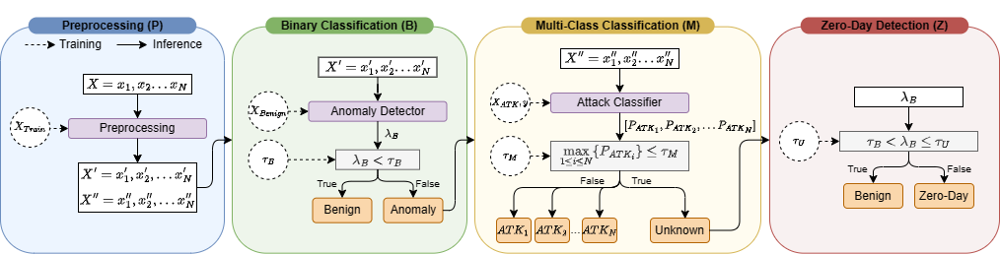

# ChronosGuard: A Hierarchical Machine Learning Intrusion Detection System for Containerized Environments

This repository contains all the code for replicating the experiments and perform the analysis on the results for the academic paper titled "[ChronosGuard: A Hierarchical Machine Learning Intrusion Detection System for Containerized Environments](todo:doi)". The paper was presented at the 20th International Conference on Network and Service Management (CNSM) 2024. 

Authors: [Miel Verkerken](https://scholar.google.be/citations?user=WiZwBjoAAAAJ), [José Santos](https://scholar.google.com/citations?user=57EIYWcAAAAJ), [Laurens D’hooge](https://scholar.google.be/citations?user=NQe4w9UAAAAJ), [Tim Wauters](https://scholar.google.be/citations?user=Kvxp9iYAAAAJ), [Bruno Volckaert](https://scholar.google.be/citations?user=NIILGOMAAAAJ) and [Filip De Turck](https://scholar.google.be/citations?user=-HXXnmEAAAAJ)

## Code Organization

Overview of directories:
- **'analysis'**: contains all the code to reproduce the insights and graphs from the experiment results.
- **'containers'**: contains the containerized components, Dockerfile's, and source code for *ChronosGuard* as well as the *Locust* load generator. Contains docker compose file for local testing.
- **'k8s-deployment'**: contains all the deployment files for Kubernetes (K8s), and automation scripts to run the experiments.

## Experimental Results

This repository only contains the aggregated results, in the analysis directory, extracted from the raw data. To reproduce the aggregated results use the following steps:
1. Download the raw data from the nextcloud public share `https://cloud.ilabt.imec.be/index.php/s/9CCkLNEkB8grzRB`.
2. Unzip the download.
3. Execute the script `analysis/process_raw_results.py`. Make sure to point the variable `BASE_DIR` to the correct download folder.

## Contact

If you have any questions or comments regarding the paper, code, or results, feel free to contact the corresponding author at Miel.Verkerken@UGent.be. We welcome any feedback or suggestions for future work in this area. 

## License

Please refer to the `LICENSE.md` file for more information on the license terms and conditions.